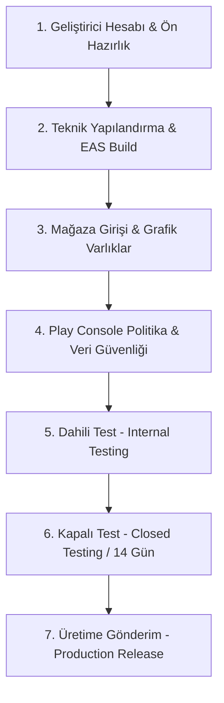

# 🚀 PortTrack Android - Google Play Store Yayınlama Yol Haritası & Kontrol Listesi

Bu doküman, **PortTrack Android** uygulamasının Google Play Store'da resmi olarak yayınlanması için gereken tüm adımları, teknik hazırlıkları, mağaza varlıklarını, yasal formları ve Google'ın 14 günlük kapalı test zorunluluğunu adım adım içeren eksiksiz bir rehberdir.

> **Nasıl Kullanılır?**  
> Tamamladığınız her adımın başındaki `[ ]` kutucuğunu `[x]` olarak işaretleyerek ilerlemenizi takip edebilirsiniz.

---

## 📋 GENEL SÜREÇ ÖZETİ



---

## 1. 🏢 GELİŞTİRİCİ HESABI & HESAP AÇILIŞI

- [x] **1.1. Google Play Console Hesabı Oluşturma**
  - Google Play Console hesabı aktif ve hazır.
- [x] **1.2. Kimlik & Adres Doğrulaması**
  - Geliştirici kimlik ve adres doğrulaması tamamlandı.
- [x] **1.3. Geliştirici Profil Bilgileri**
  - Geliştirici profili ve iletişim bilgileri hazır.

---

## 2. ⚙️ TEKNİK YAPILANDIRMA & DERLEME (EAS BUILD)

- [ ] **2.1. `app.json` Yapılandırma Kontrolü**
  - [x] `name`: `"PortTrack"`
  - [x] `package`: `"com.porttrack.app"` (Benzersiz paket adı)
  - [x] `version`: `"1.0.0"` (Kullanıcıya görünen sürüm)
  - [x] `versionCode`: `1` (Her yeni güncellemede +1 artırılacak)
  - [x] `userInterfaceStyle`: `"dark"` veya `"automatic"`
  - [x] `scheme`: `"porttrack"`
- [ ] **2.2. Uygulama İkonları & Açılış Ekranı (Splash)**
  - [ ] **Uygulama İkonu (`assets/icon.png`):** 512x512 px, PNG (32-bit renk, alpha kanalı olmayan, köşeleri yuvarlatılmamış düz kare).
  - [ ] **Adaptif İkon (`assets/adaptive-icon.png`):** Android için 432x432 px ön plan görseli + `#090d16` arka plan rengi.
  - [ ] **Splash Ekranı (`assets/splash-icon.png`):** Açılış logosu ve `#090d16` arka plan rengi.
- [ ] **2.3. EAS CLI Kurulumu ve Giriş**
  ```bash
  npm install -g eas-cli
  eas login
  ```
- [ ] **2.4. Üretim İçin Android App Bundle (.aab) Derlemesi**
  - Google Play artık `.apk` değil, sadece **`.aab` (Android App Bundle)** kabul etmektedir.
  ```bash
  cd PortTrackAndroid
  eas build --platform android --profile production
  ```
  - *Not: EAS build tamamlandığında `.aab` dosyasını bilgisayarınıza indirin veya EAS linkini hazır bulundurun.*
- [ ] **2.5. Test APK'sı Derleme (Cihazda Doğrudan Denemek İçin)**
  ```bash
  eas build --platform android --profile preview
  ```

---

## 3. 🎨 MAĞAZA GİRİŞİ (STORE LISTING) & GÖRSEL MATERYALLER

- [ ] **3.1. Metin İçerikleri (Türkçe & İngilizce)**
  - [ ] **Uygulama Adı (Maks. 30 Karakter):**  
    `PortTrack: Portföy & Fon Takip`
  - [ ] **Kısa Açıklama (Maks. 80 Karakter):**  
    `BIST, TEFAS Fonları, Kripto, Döviz ve Altın yatırımlarınızı tek yerden takip edin.`
  - [ ] **Tam Açıklama (Maks. 4000 Karakter):**  
    *Özellikleri listeleyen detaylı açıklama:*
    - 📊 BIST, TEFAS, BES Fonları, Döviz, Emtia ve Kripto portföy takibi.
    - 📈 TEFAS Fon Yatırımcı Sayısı Dinamikleri ve 4 Haftalık Talep Analizi.
    - 💵 Çift Para Birimi: Anlık TRY ve USD portföy değerleme ve kâr/zarar.
    - 📅 Kümülatif Yıllık Özet & Aylık Dağılım performans tabloları.
    - ⚡ Canlı piyasa verileri ve anlık getiri grafikleri.
- [ ] **3.2. Grafiksel Varlıklar (Play Store Gereksinimleri)**
  - [ ] **Uygulama Simgesi:** 512 x 512 px, 32-bit PNG, maks 1 MB.
  - [ ] **Özellik Grafiği (Feature Graphic - Banner):** 1024 x 500 px, JPG veya 24-bit PNG (Alfa kanalsız), maks 15 MB.
  - [ ] **Telefon Ekran Görüntüleri (Screenshots):**  
    - En az **4-6 adet** dikey ekran görüntüsü (Önerilen: 1080 x 2400 px veya 1242 x 2688 px).
    - 1. Ekran: Genel Bakış & Varlık Dağılımı (Donut Grafik & Portföy Değeri).
    - 2. Ekran: Fon Analiz (TEFAS Talep Dengesi & Sparkline Grafikleri).
    - 3. Ekran: Gelişim & Yıllık/Aylık Dağılım Tabloları.
    - 4. Ekran: İşlemler & Yeni Varlık Ekleme Ekranı.
- [ ] **3.3. Kategorilendirme**
  - **Uygulama Türü:** Uygulama (App)
  - **Kategori:** Finans (Finance)
  - **Etiketler (Tags):** Finans, Borsa, Portföy Takibi, Yatırım Fonları.

---

## 4. ⚖️ POLİTİKA, GİZLİLİK & VERİ GÜVENLİĞİ (DATA SAFETY)

Google Play Console sol menüsündeki **"Uygulama İçeriği" (App Content)** altındaki tüm formların doldurulması zorunludur:

- [ ] **4.1. Gizlilik Politikası (Privacy Policy URL)**
  - Web sitenizde bir `/privacy` sayfası barındırın (Örn: `https://porttrack.vercel.app/privacy`).
  - Linki Play Console'a girin.
- [ ] **4.2. Uygulama Erişimi (App Access)**
  - PortTrack giriş/kayıt gerektirdiği için Google denetçilerine bir **Demo Test Hesabı** tanımlayın:
    - *Kullanıcı Adı/E-posta:* `demo@porttrack.com` (veya test e-postanız)
    - *Şifre:* `Demo1234!`
    - *Açıklama:* Denetçinin giriş yapıp tüm ekranları görebileceği yönlendirme notu.
- [ ] **4.3. Reklamlar (Ads)**
  - *"Uygulamanız reklam içeriyor mu?"* -> **"Hayır, uygulamam reklam içermiyor"** seçin.
- [ ] **4.4. Hedef Kitle ve İçerik (Target Audience)**
  - Hedef Yaş Grubu: **18 ve üzeri** seçin.
  - Çocuklara hitap ediyor mu? -> **Hayır**.
- [ ] **4.5. Finansal Özellikler Beyanı (Financial Features)**
  - *"Kişisel Finans Yönetimi / Portföy Takibi (Personal Finance Management)"* seçeneğini işaretleyin.
  - Kredi verme, bankacılık veya borsa alım-satım emri aracılığı yapmadığını; sadece takip/analiz amaçlı olduğunu belirtin.
- [ ] **4.6. Veri Güvenliği Formu (Data Safety Form)**
  - *"Uygulamanız kullanıcı verisi topluyor veya paylaşıyor mu?"* -> **Evet**.
  - **Toplanan Veriler:**
    - **Kişisel Bilgiler:** E-posta adresi (Hesap oluşturma ve kimlik doğrulama için).
    - **Finansal Bilgiler:** Kullanıcının girdiği işlem ve portföy kayıtları (Uygulama işlevselliği için).
  - **Veri Güvenliği Taahhütleri:**
    - Veriler aktarım sırasında şifreleniyor mu? -> **Evet (HTTPS/TLS)**.
    - Kullanıcılar verilerinin silinmesini talep edebilir mi? -> **Evet** (Hesap silme desteği).
- [ ] **4.7. Hükümet / Resmi Kurum Uygulaması mı?**
  - **Hayır**.

---

## 5. 🧪 DAHİLİ TEST (INTERNAL TESTING)

- [ ] **5.1. Dahili Test Parçası (Internal Track) Oluşturma**
  - Play Console > *Test etme* > *Dahili Test* bölümüne gidin.
  - Yeni sürüm oluşturun ve `eas build` ile aldığınız `.aab` dosyasını yükleyin.
- [ ] **5.2. Kendi Cihazınızda Test Etme**
  - Kendi Gmail adresinizi dahili test listesine ekleyin.
  - Verilen test bağlantısını (Opt-in URL) telefonda açıp uygulamayı Play Store üzerinden yükleyin.
  - Giriş yapma, veri çekme, işlem ekleme ve grafiklerin sorunsuz çalıştığını doğrulayın.

---

## 6. 👥 KAPALI TEST (CLOSED TESTING) - 14 GÜNLÜK ZORUNLU SÜREÇ

> [!IMPORTANT]
> **Google Play 2023+ Bireysel Hesap Kuralı:**  
> Kişisel Google Play geliştirici hesaplarının uygulamalarını Üretime (Production) açabilmeleri için:
> - En az **20 test kullanıcısı (veya 12 test kullanıcısı - hesap türüne göre)** tarafından,
> - En az **kesintisiz 14 gün boyunca** Kapalı Test parçasına dahil edilmiş ve aktif olarak test edilmiş olması zorunludur.

- [ ] **6.1. Kapalı Test Parçası (Closed Track) Oluşturma**
  - Play Console > *Test etme* > *Kapalı Test* > *Parça Oluştur* (Örn: `Alfa Testi`).
  - `.aab` paketini bu parçaya yükleyin.
- [ ] **6.2. Test Kullanıcı Listesi (E-posta Listesi)**
  - Arkadaşlarınız, aileniz veya topluluktan en az **20 kişinin Gmail adresini** içeren bir e-posta listesi (Google Group veya CSV) oluşturun.
- [ ] **6.3. Test Davet Bağlantısını Paylaşma**
  - Kapalı test parçası yayınlandıktan sonra oluşan *Web Davet Linki* ve *Android İndirme Linki*ni 20 test kullanıcısına gönderin.
  - Kullanıcıların teste katıl butonuna basıp uygulamayı telefonlarına yüklemesini sağlayın.
- [ ] **6.4. 14 Günlük Aktif Test Takibi**
  - Test kullanıcılarının 14 gün boyunca uygulamayı silmemesini ve ara sıra açıp kullanmasını sağlayın.
  - Play Console Dashboard'undaki *"14 Günlük Test İlerleme Sayacı"*nın tamamlanmasını bekleyin.

---

## 7. 🚀 ÜRETİME YAYINLAMA (PRODUCTION RELEASE)

- [ ] **7.1. Üretim Başvurusu (Apply for Production)**
  - 14 günlük kapalı test süreci başarıyla dolduktan sonra Dashboard'da **"Üretime Başvur" (Apply for Production)** butonu aktif olur.
  - Google'ın sorduğu kısa test geri bildirim anketini doldurun (Uygulamanın ne kadar test edildiği, hangi hataların çözüldüğü vb.).
- [ ] **7.2. Üretim Sürümü Yayınlama (Rollout to Production)**
  - *Sürümler* > *Üretim* sekmesine gidin.
  - En güncel `.aab` dosyasını seçin, sürüm notlarını (Release Notes) yazın.
  - **"İncelemeye Gönder" (Send for Review)** butonuna basın.
- [ ] **7.3. Google İnceleme Süreci**
  - İnceleme süresi ortalama **24 ile 72 saat** sürer.
  - Onaylandığında uygulama dünya çapında veya seçtiğiniz ülkelerde Google Play Store'da **CANLIYA** geçer! 🎉

---

## 🛠️ YAYIN SONRASI İZLEME & GÜNCELLEMELER

- [ ] **Android Vitals Takibi:** Çökme (Crash) ve ANR (Uygulama Yanıt Vermiyor) oranlarını %0.47 altında tutun.
- [ ] **Kullanıcı Yorumları & Destek:** Gelen mağaza yorumlarını yanıtlayın.
- [ ] **Yeni Güncelleme Çıkma:**
  1. `app.json` içinde `versionCode` değerini 1 artırın (Örn: `1 -> 2`).
  2. `eas build --platform android --profile production` ile yeni `.aab` oluşturun.
  3. Play Console Üretim bölümüne yükleyip incelemeye gönderin.
