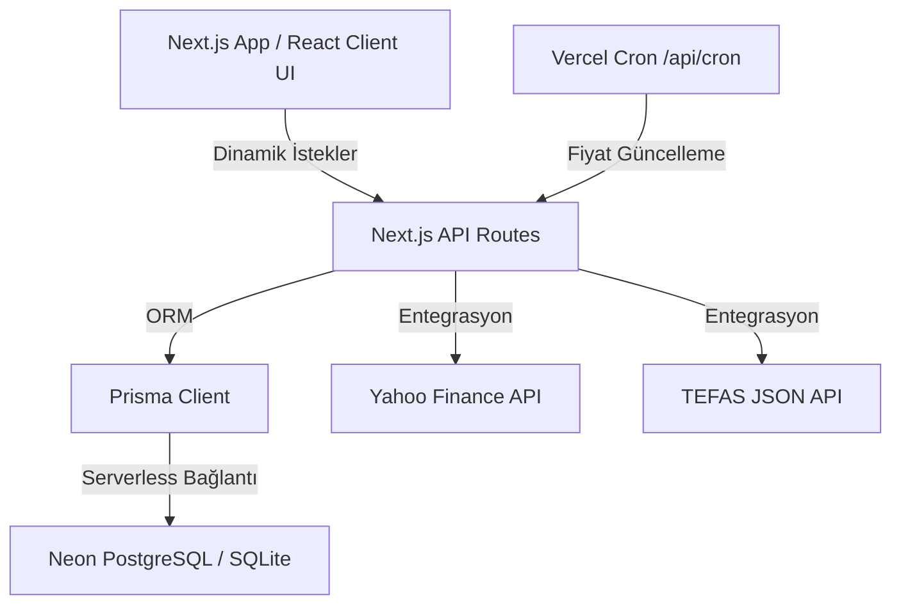

# 📈 PortTrack — Gelişmiş Yatırım ve Portföy Takip Platformu

PortTrack; BİST hisse senetleri, TEFAS fonları, yabancı borsalar (S&P 500, NASDAQ, Avrupa vb.), döviz (FX), kıymetli madenler (Altın/Gümüş) ve kripto para varlıklarını **tek bir çatı altında**, hem **₺ TL** hem de **$ USD** bazında kuruşu kuruşuna takip edebilmeniz için tasarlanmış, web tabanlı kişisel bir portföy yönetim ve analiz platformudur.

Uygulamanın canlı demosu **Vercel** üzerinde barındırılmakta ve veritabanı olarak **Neon PostgreSQL** serverless altyapısını kullanmaktadır.

---

## 🚀 Öne Çıkan Özellikler

- **Bütünsel Genel Bakış (Dashboard)**:
  - Toplam portföy değeri ve gün sonu anlık kâr/zarar durumları.
  - Varlık sınıflarına göre (Hisse, Fon, Kıymetli Maden vb.) dağılım oranları.
  - Cari Ay (MTD - Month to Date), Yıl Başından Beri (YTD) ve Tüm Zamanlar (All Time) nominal/yüzdesel performans göstergeleri.
  - Varlık sınıflarının günlük getiri katkılarını gösteren dinamik kırılımlar.
- **İnteraktif ROI (Yatırım Getirisi) & K/Z Değiştirici**:
  - Açık pozisyonlar tablosunda tek tıkla **klasik unrealized kâr/zarar** ile **ROI** (tarihsel tüm işlemler dahil bütünsel yatırım getirisi) modu arasında anlık geçiş. Sıralama algoritmaları bu modlara göre dinamik olarak çalışır.
- **Detaylı Pozisyon Modali (PositionDetailModal)**:
  - Tablodaki herhangi bir enstrümana tıklandığında açılan detay penceresi.
  - Recharts tabanlı fiyat geçmişi alan grafiği üzerinde alış (yeşil) ve satış (kırmızı) işlem noktalarının (Custom Dots) hover tooltip'leri ile gösterimi.
  - Enstrümanın son 1 yıllık performansını gösteren, koyu mod uyumlu, getiri oranına göre renklenen **Aylık Performans Matrisi**.
  - İlgili ürüne ait tarihsel tüm işlemlerin listelendiği not destekli işlem tablosu.
- **Portföy Gelişimi & Aylık Dağılım**:
  - Tarihsel portföy değeri ve maliyetlerinin ay-ay karşılaştırmalı grafiği.
  - Aylık dağılım tablosunda, her ayın getiri oranını görselleştiren çift yönlü **Aylık Δ İlerleme Çubukları (Progress Bars)**.
  - Yıl başından beri kümülatif getiri oranlarını önceki yıl sonu kapanışlarını (baseline) temel alarak hesaplayan **Kümülatif Yıllık Özet**.
- **Modern Teknik Analiz & Günün Özeti Feed'i**:
  - Sadece açık pozisyonlarınızı analiz eden, teknik göstergeleri (SMA, MACD, RSI) metinsel sinyallere ve puanlara dönüştüren analiz motoru.
  - Portföy içi yükseliş/düşüş serilerini (streaks) ve anomalileri özetleyen AI yorumlu **Günün Özeti Kartı**.
- **Çift Para Birimi & Çapraz Kur Desteği**:
  - Uygulama genelinde tek tıkla ₺ TL ⇄ $ USD dönüşümü. Çapraz kurlar (örn. İsveç Kronu - SEK, Euro - EUR) otomatik olarak normalize edilerek portföy para birimine dönüştürülür.
- **Koyu Tema (Dark Mode)**:
  - Premium renk paletine sahip, işletim sistemi tercihini veya kullanıcı seçimini tarayıcı belleğinde saklayan kesintisiz koyu tema desteği.

---

## 🛠️ Teknolojik Mimari ve Katmanlar

Platform, modern web teknolojileri ve serverless mimari en iyi pratiklerine sadık kalınarak inşa edilmiştir:



### 1. Frontend (Arayüz Katmanı)
- **Framework**: React 19 tabanlı **Next.js 15 (App Router)**.
- **Styling**: Vanilla CSS ve Tailwind CSS'in uyumlu birleşimi. Tasarım sistemi CSS değişkenleri (`index.css` & `globals.css`) üzerine kurulmuştur.
- **Grafikler**: SVG tabanlı yüksek performanslı veri görselleştirme kütüphanesi **Recharts**.
- **İkon Seti**: **Lucide React**.

### 2. Backend (Sunucu Katmanı & API)
- **Sunucusuz Mimari (Serverless)**: Vercel üzerinde çalışan hafif ve hızlı Next.js API endpoint'leri.
- **Veritabanı ORM**: Tip güvenliği ve esnek migrasyon yönetimi sağlayan **Prisma ORM**.
- **Veritabanı**: Canlı ortamda bağlantı havuzu (connection pooling) özellikli **Neon PostgreSQL**, yerel geliştirme için ise **SQLite** opsiyonu.

### 3. Veri Entegrasyon Motoru (`src/lib/prices.ts`)
- **Yabancı Varlıklar & Kripto**: Yahoo Finance API entegrasyonu yardımıyla anlık fiyat ve döviz kurları.
- **TEFAS Fonları**: Resmi TEFAS JSON API servisleri. TEFAS API'sinin dakikalık istek limitlerine (rate limits) takılmamak amacıyla özel bir **hız sınırlayıcı kuyruk (throttled queue)** yapısı kurulmuştur. Geçmiş veri doldurma işlemleri yarıda kalsa bile kaldığı yerden devam edebilecek (resumable) şekilde tasarlanmıştır.

---

## 🧠 Kritik Veri ve Hesaplama Mantığı

### 1. ROI (Return on Investment) ve Getiri Ayrımı
- **Getiri (Klasik Unrealized %)**: Sadece şu an elinizde tuttuğunuz aktif lotların maliyeti ile güncel piyasa değeri arasındaki farkı hesaplar:
  $$\text{Getiri \%} = \left( \frac{\text{Güncel Değer}}{\text{Açık Lotların Maliyeti}} - 1 \right) \times 100$$
- **ROI (Bütünsel Getiri %)**: İlgili sembolde geçmişte yaptığınız tüm kârlı/zararlı satışları (realized gains) hesaba katarak, yatırdığınız toplam net sermayeye göre nihai kârlılık oranınızı bulur:
  $$\text{ROI \%} = \left( \frac{\text{Güncel Değer} + \text{Realize Edilen K/Z}}{\text{Toplam Yatırılan Net Nakit}} - 1 \right) \times 100$$

### 2. Saat Dilimi ve Tarih Uyuşmazlığı Çözümü (`UTC+3`)
Sunucuların (örneğin Vercel) global saat diliminde (UTC) çalışması, Türkiye saatiyle (UTC+3) gece yarısına yakın yapılan işlemlerde tarihlerin 1 gün geriye kaymasına ve veritabanında mükerrer kayıt oluşmasına neden oluyordu.
- Bu durumu engellemek amacıyla, tüm tarih formatlama ve gün sonu snapshot alma işlemleri (`monthKey`, `monthKeyOf` vb.) Türkiye saat dilimi ofseti eklenerek **UTC+3 bazında normalize edilmiştir**.
- Günlük fiyat snapshot'ları daima Türkiye saatiyle ilgili günün başlangıcı (`00:00:00.000Z`) olacak şekilde veritabanına yazılır.

### 3. Hafta Sonu Mükerrer Fiyat Filtreleme (Weekend Snapshot Healing)
Hisse senedi borsaları ve yatırım fonları hafta sonu kapalı olduğundan, Cumartesi ve Pazar günleri tetiklenen fiyat güncellemeleri Cuma günkü kapanış fiyatlarını mükerrer olarak kaydeder. Bu durum tablolarda günlük değişim oranlarının `%0,00` görünmesine yol açar.
- **Çözüm**: Kripto varlıklar dışındaki tüm enstrümanlar için hafta sonu güncellemelerinde veritabanında yeni snapshot oluşturulması engellenir. Çalışma zamanında (on-the-fly) mükerrer kayıtlar filtrelenerek elenir. Böylece hafta sonu da platformda son aktif işlem gününün (Cuma) değişim oranları gösterilmeye devam eder.

### 4. BES Çift Sayım Engelleme Altyapısı
Manuel olarak girilen Bireysel Emeklilik Sistemi (BES) bakiye verilerinin, portföyün toplam varlık dağılımı içerisindeki diğer otomatik hesaplanan BES lotları ile toplanırken mükerrer (çift) sayılmasını engellemek amacıyla; `getPeriodReturns()` metodu override işlemlerini hesaplanan net varlık dağılımlarını (`byType` nesnesi) parametre olarak alıp normalize edecek şekilde gerçekleştirmektedir.

---

## 📁 Dizin ve Dosya Yapısı

```text
├── prisma/
│   ├── schema.prisma          # Veritabanı şeması (Postgres & SQLite uyumlu)
│   └── migrations/            # Veritabanı göç geçmişi
├── scripts/
│   ├── compare_totals.js      # Sayfalar arası değer uyuşma tanılama betiği
│   └── heal_db.js             # Geçmiş tarih anahtarlarını düzeltme/tekilleştirme betiği
├── src/
│   ├── app/                   # Next.js App Router sayfaları
│   │   ├── api/               # API Endpoint'leri (/cron, /analysis, /history)
│   │   ├── analysis/          # Teknik analiz görünümü
│   │   ├── transactions/      # İşlem ekleme/çıkarma görünümü
│   │   ├── performance/       # Ürün aylık performans görünümü
│   │   └── growth/            # Portföy gelişim grafikleri ve tabloları
│   ├── components/            # Yeniden kullanılabilir React UI bileşenleri
│   │   ├── DashboardClient.tsx# Genel Bakış ana paneli ve detay modalleri
│   │   ├── GrowthClient.tsx   # Portföy gelişimi ve aylık dağılım bileşenleri
│   │   ├── PerformanceClient.tsx # Aylık getiri matrisi ve koyu mod renklendiricisi
│   │   └── ui/                # Temel UI elemanları (Card, Badge, Modal)
│   ├── context/               # Global durum yöneticileri (Para birimi vb.)
│   ├── lib/                   # Çekirdek iş mantığı ve yardımcı fonksiyonlar
│   │   ├── prices.ts          # Yahoo/TEFAS fiyat çekicileri ve kısıtlayıcıları
│   │   ├── portfolio.ts       # Pozisyon kâr-zarar matematik motoru
│   │   ├── history.ts         # Geçmiş portföy gelişim serisi üreticisi
│   │   ├── refresh.ts         # Günlük fiyat güncelleyicisi
│   │   └── utils.ts           # Tarih, para ve oran formatlayıcıları
│   └── middleware.ts          # Şifre korumalı erişim ara yazılımı
```

---

## 💻 Yerel Geliştirme ve Kurulum

### 1. Ön Gereksinimler
- Bilgisayarınızda **Node.js** (v18 veya üzeri) kurulu olmalıdır.

### 2. Adımlar
1. Depoyu yerel bilgisayarınıza kopyalayın.
2. Bağımlılıkları yükleyin:
   ```bash
   npm install
   ```
3. `.env` dosyasını oluşturun:
   Yerelde SQLite kullanmak için `.env` içeriğini aşağıdaki gibi ayarlayabilirsiniz:
   ```env
   DATABASE_URL="file:./dev.db"
   APP_PASSWORD="sizin_sececeginiz_giris_sifresi"
   AUTH_SECRET="en_az_32_karakterli_rastgele_bir_dize"
   CRON_SECRET="cron_tetikleme_anahtari"
   ```
4. Prisma şemasını SQLite veritabanına uygulayın:
   ```bash
   npx prisma db push
   ```
5. Geliştirme sunucusunu başlatın:
   ```bash
   npm run dev
   ```
   Tarayıcınızdan `http://localhost:3000` adresine giderek uygulamaya erişebilirsiniz.

---

## ☁️ Buluta Dağıtım (Deployment)

### 1. Neon PostgreSQL Kurulumu
1. [Neon.tech](https://neon.tech) üzerinde ücretsiz bir proje oluşturun.
2. Size verilen PostgreSQL bağlantı dizesini (`postgres://...`) kopyalayın.
3. Proje dizinindeki `prisma/schema.prisma` dosyasında veritabanı sağlayıcısını `postgresql` olarak güncelleyin:
   ```prisma
   datasource db {
     provider = "postgresql"
     url      = env("DATABASE_URL")
   }
   ```

### 2. Vercel Dağıtımı
1. Projenizi GitHub'a yükleyin.
2. Vercel panelinden projenizi GitHub deponuza bağlayın.
3. Vercel **Environment Variables** bölümüne aşağıdaki değişkenleri ekleyin:
   - `DATABASE_URL`: Neon'dan aldığınız bağlantı dizesi.
   - `APP_PASSWORD`: Giriş şifreniz.
   - `AUTH_SECRET`: Güvenlik anahtarınız.
   - `CRON_SECRET`: Cron güvenlik anahtarınız.
4. "Deploy" butonuna basarak projeyi canlıya alın. Vercel otomatik olarak projenizi derleyecek ve yayına alacaktır.
5. Canlıya aldıktan sonra terminalden `npx prisma db push` komutu ile (DATABASE_URL alanını Neon veritabanınız olarak set ederek) PostgreSQL tablolarınızı oluşturun.

### 3. Vercel Otomatik Cron Yapılandırması
Uygulamanın her gün borsaların kapanış saatinden sonra fiyatları otomatik güncelleyebilmesi için `vercel.json` dosyasında tanımlı bir cron job mevcuttur.
- Her gün Türkiye saatiyle **21:00**'da (18:00 UTC) `/api/cron` API ucu Vercel tarafından otomatik çağrılır ve fiyatlar arka planda güncellenir.
- Bu istekler `CRON_SECRET` başlığı ile korunduğundan dışarıdan yetkisiz tetiklemeler engellenir.

---

## 🧪 Tanılama ve Doğrulama Araçları

Portföy verilerinizin kuruşu kuruşuna doğruluğunu denetlemek için yazılmış betikleri kullanabilirsiniz:
- **compare_totals.js**: Genel Bakış sayfasındaki toplam varlık değerleri ile Portföy Gelişimi sayfasındaki zaman serisinin son noktasını karşılaştırarak farkları raporlar.
  ```bash
  node scripts/compare_totals.js
  ```
- **heal_db.js**: Veritabanındaki eski timezone farkı nedeniyle oluşmuş mükerrer fiyat geçmişi snaphot'larını tarar, normalize eder ve tekilleştirir.
  ```bash
  node scripts/heal_db.js
  ```

---

## 📜 Lisans

Bu proje kişisel kullanım amacıyla geliştirilmiştir. Tüm hakları saklıdır.
